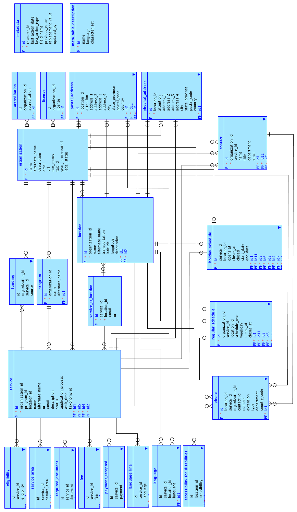
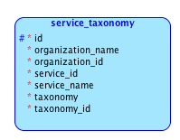

# Human Services Data Specification v1.0

## Introduction

The Human Services Data Specification (Open Referral) is an exchange format for publishing machine readable data about health, human, and social services, their locations, and the organizations that provide them.  For the purposes of this specification, human services are broadly defined, ranging from food assistance to job training and health care. This exchange format is meant to complement –not replace– existing storage formats currently in use.

All organizations that provide services or referrals, as well as entities that consume or distribute digital human services information, are invited to publish their data in this format, whether they be governments at the local, state, or federal level; civic organizations, or companies.

**The primary use case served by Open Referral is the provision of information about many services to a common or overlapping audience.** 

Government entities, community organizations, and businesses often face difficulty obtaining timely and correct data about human services. The Human Services Data Specification facilitates the open exchange and use of data and information among these stakeholders.  To that end, the specification is designed to provide an interoperable format for web and application developers.

The development of Open Referral has to date been sponsored and funded by the Knight Foundation and Code for America. Learn more about Code for America’s support of data standards [here](http://www.codeforamerica.org/cities/data-standards-faq/).

***

## Table of Contents

__Section 1: About the Human Services Data Specification__

[Related Standards](#relatedstandards)

[Use Cases](#usecases)

[Design Principles](#designprinciples)

[Human Services Data Specification Roadmap](#roadmap)

[Human Services Data Specification Data Capabilities](#capabilities)

[Specification Governance](#governance)

__Section 2: Producing Compliant Data__

[CSV Formatting](#csv)

[Telephone Formatting](#telephone)

[Address Formatting](#address)

[Description Field Formatting](#description)

[Guidance on Mapping Fields and Values](#guidance)

__Section 3: Document Status__

[Version](#version)

[Copyright](#copyright)

[Changelog](#changes)

__Appendix A__

[A Controlled Vocabulary for Human Services Data](#vocabulary)

__Appendix B__

[Logical Model](#model)

[Entities](#entities)

__Appendix C__

[Tabular Data Package](#package)

__Appendix D__

[Taxonomic Overlays](#taxonomy)

***

<a name="relatedstandards">
## Related Standards

### AIRS Standards

The AIRS Standards defines expected practices within an information and referral (I&R) program and best practices to meet the needs of their community. According to [AIRS Standards and Quality Indicators for Professional Information and Referra](http://www.airs.org/files/public/AIRS_Standards_7_Final.pdf)l:

"The Standards address all aspects of an I&R operation. They define the information and referral process in concrete terms; establish criteria for database development; mandate support for community planning activities; incorporate a broad view of collaboration at the local, state or provincial, regional and national levels; include provisions for the socially responsible use of technology; and describe the role of information and referral services in times of disaster. “

The Resource Database Standard of the AIRS Standards is pertinent to the Human Services Data Specification. As described in the AIRS Standards and Quality Indicators publication, the Resource Database Standard:

"The Resource Database standards require that the I&R service develop, maintain, use and disseminate an accurate, up-to-date resource database that contains information about available community resources including details about the services they provide and the conditions under which services are available. The database includes resources that support the inquirer’s right to accurate, consistent, comprehensive and unbiased information and the ability of the I&R service to be a non-partisan, non-ideological and impartial information source for available nonprofit, government and for-profit services that meet the organization’s inclusion/exclusion criteria. The database is maintained by trained resource specialists." 

### schema.org for Public Civic Services

[Public Civil Services](http://www.w3.org/wiki/images/0/03/Services_for_schema.org_%28DRAFT_2013-06-27%29.pdf) is a [W3C proposal](http://www.w3.org/wiki/WebSchemas/CivicServices) by the Google.org Social Impact team that extends the Schema.org schemas to better support the description of public civic services.

It is a new vocabulary, similar to the European Commission ISA Core Public Service vocabulary. Its purpose is to improve search engines’ understanding of these services. The schema will provide "*enough information to determine the service, the area covered by the service, and relevant information for using the service*." 

### Open Eligibility

[Open Eligibility](http://openeligibility.org/) is a "*simple way to categorize human services and human situations*." It uses common categories for quickly finding human services for people in need, service providers and navigators. It takes a different approach than the AIRS standards by grouping similar services and repeatedly and empirically testing the categories. Open Eligibility explains their taxonomy as:

> "Every provider administers at least one program. Every program provides at least one client-facing service. And every service is represented with a service tag. Our taxonomy is a categorization of those service tags."

### National Information Exchange Model (NIEM)

NIEM is the National Information Exchange Model. It is an interagency initiative to create a national-level interoperable information sharing and data exchange. The NIEM project began in 2005 as a joint venture between the U.S. Department of Homeland Security (DHS) and the U.S. Department of Justice (DOJ). The NIEM uses both the Global Justice XML Data Model (GJXDM) reference model and the GJXDM XML-based framework and support infrastructure.

NIEM consists of a  collection of data components organized in multiple kinds of XML Schema that are classified into broad categories. Of interest to the Human Services Data  Standard are the NIEM Core Components. There are two types of NIEM Core components:

1. Universal components such as Person, Date, Location etc., that are relevant and understood across all domains
2. Common components such as LocationStateUSPostalServiceCode, LocationStateCanadianProvinceCode etc., that are relevant and understood across two or more domains

The schema for the core components is available from [niem.gov](http://release.niem.gov/niem/niem-core/2.0/niem-core.xsd).

***

<a name="usecases">
## Use Cases

### Help Seeker

Help seekers  (i.e. patients, clients, consumers, victims, survivors, etc.) have a need (or multiple needs) that can be addressed by services in their community. To find services, help seekers must receive accurate, relevant, and easily understandable information about services which they can access and for which they are eligible. 

Help seekers may not be capable of articulating the addressable aspect of their needs. They may have limited media literacy and limited access to technology. They may not know about the existence of relevant services, let alone the ‘correct’ terms to describe those services. They may have difficulty processing and/or trusting information. They may struggle with anticipated or actual stigmatization for seeking help. Incorrect information can cost help-seekers time, money, or even conceivably lives. 

Help seekers might currently look for help by searching the Internet or turning to a trusted community anchor like a library, school, or religious institution. They might talk to a service provider ("referrer") who can help identify addressable needs (through some screening process) and provide them with actionable information about services.

*As a help-seeker, I want to find services that meet my needs.*

### Referrer

A Referrer is the person who engages directly with a help-seeker (often face-to-face) and helps them find relevant and accessible services. A ‘referrer’ is usually (but not always) a professional or a volunteer who is working for an organization that itself provides as a service to its community (i.e. case manager, social worker, health worker, EMT, patient intake, librarian, teacher, etc.). Referrers are typically the primary users of resource directory information systems. 

Referrers require:

1. accurate information,
2. the service’s relevance (is the client eligible), and 
3. the quality of the service. 

Referrers commonly interact with help seekers using a structured workflow that includes a screening process to identify important attributes of the help-seeker’s situation. Referrers match information gathered from the help-seeker to accessible and relevant services. 

*As a referrer (aka service provider, etc), I want to provide relevant and accurate information about services.*

### Researcher

A Researcher uses service directory data, in synthesis with other kinds of data, for the purpose of understanding community health, predicting future needs, identifying funding gaps, and other kinds of analysis. Such a role is often played by funders, policymakers, planners, or community leaders.

Researchers study the effectiveness of *programs*, which may not be specific services but rather a set of services bundled through a funding stream and around a common mission. Researchers seek accountability for the performance of the health, human, and social service system overall. They want their work to make this data useful for system-level decision-making. Researchers need reliably structured data, from across institutional and jurisdictional boundaries, that can be readily ‘mashed up’ with other kinds of data (census, funding, etc). 

*As a researcher, I need data in raw formats over a specific time period and meaningful context for service information so that I can perform efforts-to-outcomes and population-level analysis.*

### Data Administrator

A Data Administrator is responsible for  information systems that are a compilation of directories. Data administrators produce and maintain information; tasks include updating records, maintaining naming conventions, running reports, designing mechanisms for retrieval and delivery, etc. They may be responsible for reporting directly to funders and government agencies. These responsibilities are sometimes shared among several roles in an organization. 

*As a data administrator, I want a data maintenance process flow enabled by a simple and easy to use interface to update data quickly and efficiently.*

***

<a name="designprinciples">
## Design Principles

The design of  Human Services Data Specification is based on five principles: simplicity, factual, fidelity, provenance, and accessibility.

The underlying model is simple, consisting of four entities and associated properties that support who, what, where and when questions. The relationships between the entities are flexible and can model the majority of use cases for human services data. The goal is to build the simplest useful thing.

The data provided in the Human Services Data Specification are factual. This means that the information is verifiable and can be reproduced across different systems and applications.

Data fidelity is important. Data reproduced and used across different information systems must retain the same meaning and be represented in a consistent way. Implementing fidelity leverages the use of existing standards such as ISO time and date formats.

The standard must include information about the provenance of the data as well as a history of changes in order to provide an authoritative source. The standard supports column level metadata for a high degree of granularity.

The data must be a machine readable and writable format that can be created, updated and deleted with a basic text editor.

<a name="roadmap">
## Human Services Data Specification Roadmap

Open Referral does not yet incorporate the full range of data necessary to meet domain specific use cases. Specifically, the working group intends to address the following topics. 

* Acceptance of initial specification with regards to content, data type, and format 
* Process for receiving, validating, and incorporating user input
* Develop a long term roadmap leading to the 1.0 release
* Develop process for creating domain specific profiles and incorporating taxonomy
* Develop process for creating wire formats 

### A Common Vocabulary

The Human Services Data Specification seeks to establish a common vocabulary among information and referral (I&R) practitioners. The vocabulary reflects the simple model of four required entities: Organizations, Locations, Services, and Metadata. An optional entity is Programs, which is available for organizations that use Programs for grouping Services.  Entities have attendant properties and some properties are complex and have multiple attributes. For example addresses are comprised of several pieces of information.. 

The relationship between organizations as the primary entity and services and locations as subordinate entities is loosely coupled in recognition that service providers may organize the data in different ways and that human services continue to evolve. For example, some services such as virtual support groups or informational websites may not have a physical location.

***

<a name="capabilities">
## Current Human Services Data Capabilities

The specification supports:

* Provisioning the minimum amount of data needed to implement a service for search and discovery of human services provided by organizations
* Machine readable format that can be imported directly into a relational database or viewed and edited using commonly available software such as a spreadsheet or a text editor
* A common data exchange format between different information and referral systems.

<a name="governance">
### Specification Governance

To promote participation and accessibility, this Google Document serves as the working draft of the next version of Human Services Data Specification.  Edits, improvements and changes should first be discussed using the Comments feature. 

#### Versions

Subsequent to publishing version 1.0, the specification will not change for a given period of time, to be determined by the Working Group. This will allow data producers and consumers to reliably build upon the specification. 

This working document--and the [complementary Google Group](https://groups.google.com/forum/#!forum/plats-discussion)-- will continue to serve as a forum for discussion and feedback. These conversations will inform the future evolution of the specification.

***

## Section 2: Producing and Sharing Compliant Data 

<a name="csv">
### CSV Formatting

For ease of data production, Human Services Data Specification specifies that all files are provided in a simple comma-separated value format (.csv). The CSV format described herein conforms to [RFC4180](http://tools.ietf.org/html/rfc4180). Text will used the UTF-8 character set.

<a name="telephone">
### Telephone Formatting

HSDS uses[ E.164](http://www.itu.int/rec/T-REC-E.164-201011-I/en) number formatting for phone numbers E.164 numbers can have a maximum of fifteen digits and are usually written as follows: [+][country code][subscriber number including area/region code]. Phone numbers can contain delimiters.

<a name="address">
### Address Formatting

At the time this document was drafted, a standard addressing format has not been established. ISO 19160  is in the preliminary stages of an addressing standard but has not yet produced a standard. Based on address standards by country from the Universal Postal Union,  the following format will capture the majority of addresses in use globally.

	address_1
	address_2
	address_3
	adderss_4
	city/locality
	state/province/region
	postal code
	country

Because of the variety of addressing systems, every field is composed of alphanumeric characters. The country field uses ISO-3166 alpha 2 codes.

<a name="description">
### Description Field Formatting

The description field may include HTML or MarkDown tags.

<a name="guidance">
### Guidance on Mapping Fields and Values

Source data may or may not map directly to the HSDS. Guidelines are listed below to reduce ambiguity.

* A null value is acceptable for required fields. 
* If there are no values for an entity, the corresponding CSV file can be omitted. 
* A data source may have a field that can map to an HSDS field but in many cases are not populated. A null value is acceptable.
* In some cases, such as name, using the organization name for either or both location or service is acceptable. This is up to the discretion of the data producer.
* Mapping a field is at the data producer’s discretion, but it is acceptable for some entities to map to multiple entities, for example an organization, service, or location can have a contact.
* The HSDS is a baseline of data, if the the data producer’s has additional fields or entities that they wish to add, the specification can be extended to incorporate them. The data producer should provide documentation of how the specification has been extended.

***

## Section 3: Document Status

<a name="version">
### Version

This is version 0.9 of the specification.  

<a name="copyright">
### Copyright

Human Services Data Specification is licensed under the CC0 license, which is the "no copyright reserved" option in the Creative Commons toolkit - it effectively means relinquishing all copyright and similar rights that you hold in a work and dedicating those rights to the public domain. To view a copy of this license, visit [Creative Commons License](https://creativecommons.org/publicdomain/zero/1.0/).

***

<a name="changes">
### Changelog

[v0.0](https://docs.google.com/document/d/1RwHkuPeG5cztk-gcofuqsXRxWaTYZeHa8mLjC2doCwk/edit?usp=sharing) 	

No changes.

[v0.1](https://docs.google.com/document/d/18vdB0DUvBfp6UcYQ78KaMmN3Ei2riThJL48V7TTOHHQ/edit?usp=sharing)	

* Changes from comment period, workshop comments, and a running [summary of comments](https://docs.google.com/spreadsheets/d/19Sf7DPMooO6edEm8FcIjSv6VeC1Ar55YDBvLTl-S4dE/edit?usp=sharing).
* Directly references [RFC4180](http://tools.ietf.org/html/rfc4180) for CSV formatting

[v0.2](https://docs.google.com/document/d/1z4jSLCoDIqvkKnazZVH_7qP_5HkcgKhnPJLu1mUZBgA/edit?usp=sharing)	

* Added related standards
* Aded use cases based on persona
* Reformatted the controlled vocabulary.
* Added a logical model
* Made changes from [comments](https://docs.google.com/spreadsheets/d/19Sf7DPMooO6edEm8FcIjSv6VeC1Ar55YDBvLTl-S4dE/edit?usp=sharing) collected during the second RFC period
* Added Appendix C: Tabular  Data Package description

[v0.3](https://docs.google.com/document/d/1RH89UY7FDndivWNmtQkql4tdRTwYnCZluyu8itp5nTw/edit?usp=sharing)	

* Refined logical model to conform to Boyce-Codd third normal form
* Updated datapackage.json to match logical model
* Included enumerations for  entities in datapackage.json
* Added section on NIEM and relation to specification
* Made changes based on reviewer comments.

[v0.4 - v0.7](https://docs.google.com/document/d/1xTqNm3ShgL6vQtknMmkCNJeWapekrLxd1qpEa8WiEIk/edit?usp=sharing)

* Updated data model based on reviewer comments
* Tested logical model by importing data from iCarol database
* Exported data in HSDS format from previous tes
* Added Open Eligibility taxonomic overlay to logical model using Postgres ltree
* Tested OE taxonomy by querying the service_taxonomy to return the related service
* Provided test scripts and example data

[v0.8](https://docs.google.com/document/d/1gmNS4pBvkX4cI2wtH3Qco3uGF4LLTq1OJ0Pb_CLuxlk/edit?usp=sharing)

* Added formatting specification for address, phone, description	

[v0.9](https://docs.google.com/document/d/1jbgO92cPAUygQI-0_DtLXrdPQKbPNNIkxDr-3WvdFNE/edit?usp=sharing)

* Changes based on public comments in v0.8 include:
	- revising revising schedule entities and attributes  as recommended, 
	- grammatical and punctuation edits, 
	- changing SMS attribute to a phone type
	- changed language_line to interpretation_services 
* Released on github as a markdown document
* Added a datapackage.json example on github

[v1.0](https://docs.google.com/document/d/1dkipRm_YL3K28oTSG-NFZRMHYiv10ZZJzJlakZglOyc/edit?usp=sharing)

* Final version
* Changed relationship between location and service from 1:n to n:m

***

## Appendix A

<a name="vocabulary">
### A Controlled Vocabulary for Human Services Data

<table>
  <tr>
    <td>Term</td>
    <td>Description</td>
    <td>Example</td>
    <td>Required,
Recommended or Optional</td>
  </tr>
  <tr>
    <td>Accessibility for Disabilities</td>
    <td>Description of assistance or infrastructure that facilitate access to clients with disabilities.</td>
    <td>wheelchair</td>
    <td>recommended</td>
  </tr>
  <tr>
    <td>Accreditation</td>
    <td>Accreditation is the formal evaluation of an organization or program against best practice standards set by an accrediting organization.</td>
    <td>Child and Youth Development Program</td>
    <td>optional</td>
  </tr>
  <tr>
    <td>Alternate Name</td>
    <td>Alternative or commonly used name for an organization, program, service, or location.</td>
    <td>MSWC Pre-Natal Program</td>
    <td>recommended</td>
  </tr>
  <tr>
    <td>Application Process</td>
    <td>The steps needed to access the service.</td>
    <td>Call for appointment with counselor.</td>
    <td>recommended</td>
  </tr>
  <tr>
    <td>Attention</td>
    <td>An address can have an 'Attention' label to specify the recipient.</td>
    <td>Joshua Fisher</td>
    <td>optional</td>
  </tr>
  <tr>
    <td>City</td>
    <td>The city where the Organization, Service or Location resides.</td>
    <td>Redwood City</td>
    <td>required</td>
  </tr>
  <tr>
    <td>Closes At </td>
    <td>Time when a service or location is closed</td>
    <td>2013-11-05T13:15:30Z</td>
    <td>optional</td>
  </tr>
  <tr>
    <td>Closed</td>
    <td>Indicates if a service or location is closed during a public holiday</td>
    <td>true</td>
    <td>required</td>
  </tr>
  <tr>
    <td>Contact</td>
    <td>A person associated with an organization or service.</td>
    <td>April Smith</td>
    <td>recommended</td>
  </tr>
  <tr>
    <td>Country</td>
    <td>The country where the Organization, Service or Location is located. Uses ISO 3361-1 country codes (two letter abbreviations)</td>
    <td>US</td>
    <td>required</td>
  </tr>
  <tr>
    <td>Country Code Prefix</td>
    <td>The country code prefix of the phone.</td>
    <td>19</td>
    <td>optional</td>
  </tr>
  <tr>
    <td>Last Action Date</td>
    <td>The date when information was created,updated, or deleted</td>
    <td>2013-11-05T13:15:30Z</td>
    <td>required</td>
  </tr>
  <tr>
    <td>Department</td>
    <td>The department that the contact works in.</td>
    <td>Human Resources</td>
    <td>optional</td>
  </tr>
  <tr>
    <td>Description</td>
    <td>A brief summary about the organization, location or service. It can contain markup such as HTML or Markdown.
</td>
    <td>Haven for Hope assists homeless individuals find housing and employment.</td>
    <td>required</td>
  </tr>
  <tr>
    <td>Required Document</td>
    <td>Document required to apply for or receive  service.</td>
    <td>Government issued identification card</td>
    <td>optional
</td>
  </tr>
  <tr>
    <td>Eligibility</td>
    <td>Rules or guidelines that determine who can receive the service.</td>
    <td>teen</td>
    <td>recommended</td>
  </tr>
  <tr>
    <td>Email</td>
    <td>Email for organization or service</td>
    <td>info@havenforhope.org</td>
    <td>recommended</td>
  </tr>
  <tr>
    <td>End Date</td>
    <td>The last day that a service or location is closed during a public or private holiday</td>
    <td>2013-11-05T</td>
    <td>required</td>
  </tr>
  <tr>
    <td>Extension</td>
    <td>Phone extension </td>
    <td>210</td>
    <td>optional</td>
  </tr>
  <tr>
    <td>Fee</td>
    <td>A listing of the costs of services.</td>
    <td>free - school immunization</td>
    <td>recommended</td>
  </tr>
  <tr>
    <td>Field Name</td>
    <td>Name of field modified</td>
    <td>license</td>
    <td>required</td>
  </tr>
  <tr>
    <td>Funding</td>
    <td>Source of funds for organization or service</td>
    <td>Philanthropic Ventures</td>
    <td>optional</td>
  </tr>
  <tr>
    <td>Regular Schedule</td>
    <td>Time and days when the service is available to the public. </td>
    <td>2013-11-05T13:15:30Z</td>
    <td>optional</td>
  </tr>
  <tr>
    <td>Holiday Schedule</td>
    <td>Time and days when the service is available to the public during public holidays or other events</td>
    <td>2013-11-05T13:15:30Z</td>
    <td>optional</td>
  </tr>
  <tr>
    <td>Id</td>
    <td>Each organization, address, contact, phone and metadata record has a unique identifier.</td>
    <td>BEC0BA53-4A24-400F-8F05-A24831D54618</td>
    <td>required</td>
  </tr>
  <tr>
    <td>Interpretation Service</td>
    <td>AA phone translation service at a service provider. Languages are listed as ISO639-1 codes.</td>
    <td>es</td>
    <td>optional</td>
  </tr>
  <tr>
    <td>Language</td>
    <td>Languages, other than English, in which the service is delivered. Languages are listed as ISO639-1 codes.</td>
    <td>es</td>
    <td>recommended</td>
  </tr>
  <tr>
    <td>Last Action Timestamp</td>
    <td>Timestamp when data was changed.</td>
    <td>2013-11-05T13:15:30Z</td>
    <td>required</td>
  </tr>
  <tr>
    <td>Last Action Type</td>
    <td>The kind of change made to the data create,update, delete</td>
    <td>delete</td>
    <td>required</td>
  </tr>
  <tr>
    <td>Latitude</td>
    <td>Y coordinate of location expressed in decimal degrees in WGS84 datum.</td>
    <td>-93.35556</td>
    <td>recommended</td>
  </tr>
  <tr>
    <td>Legal Status</td>
    <td>The legal status defines the conditions that an organization is operating under; e.g. non-profit, private corporation or a government organization.</td>
    <td>non-profit</td>
    <td>optional</td>
  </tr>
  <tr>
    <td>License</td>
    <td>An organization may have a license issued by a government entity to operate legally.</td>
    <td>food handler license</td>
    <td>optional</td>
  </tr>
  <tr>
    <td>Location Id</td>
    <td>Each service can include a location referenced by a Location.Id</td>
    <td>1CB7893F-86A1-49FD-9193-87C233E2ADB2</td>
    <td>required</td>
  </tr>
  <tr>
    <td>Longitude</td>
    <td>X coordinate of location expressed in decimal degrees in WGS84 datum. </td>
    <td>recommended</td>
    <td>recommended</td>
  </tr>
  <tr>
    <td>Opens At </td>
    <td>Time when a service or location is open</td>
    <td>2013-11-05T13:15:30Z</td>
    <td>optional</td>
  </tr>
  <tr>
    <td>Physical Address</td>
    <td>A physical address describes the location of a service or organization.</td>
    <td>1510 South Hackberry
San Antonio, TX 78210</td>
    <td>recommended</td>
  </tr>
  <tr>
    <td>Postal Address</td>
    <td>A postal address describes where a service or organization receives mail.</td>
    <td>1510 South Hackberry
San Antonio, TX 78210</td>
    <td>recommended</td>
  </tr>
  <tr>
    <td>Payment Accepted</td>
    <td>The kind of payment accepted for a service.</td>
    <td>Medicare</td>
    <td>recommended</td>
  </tr>
  <tr>
    <td>Name</td>
    <td>The official or public name of the organization, service, program, location, or contact</td>
    <td>Haven for Hope</td>
    <td>required</td>
  </tr>
  <tr>
    <td>Replacement  Value</td>
    <td>The replacement value</td>
    <td>Happy House</td>
    <td>required</td>
  </tr>
  <tr>
    <td>Organization Id</td>
    <td>The organization.Id is the unique identifier for an organization</td>
    <td>BEC0BA53-4A24-400F-8F05-A24831D54618</td>
    <td>required</td>
  </tr>
  <tr>
    <td>Contact Id</td>
    <td>contact.Id is the unique identifier for a contact</td>
    <td>388BD194-5731-4D66-B8FC-F48A84DDD1FC</td>
    <td>optional</td>
  </tr>
  <tr>
    <td>Phone</td>
    <td>The phone number used to contact an organization, service, or location.</td>
    <td>210-512-3345</td>
    <td>required</td>
  </tr>
  <tr>
    <td>Postal Code</td>
    <td>The postal code that the Organization, Service or Location resides. Zip+4 is optional in the US.</td>
    <td>99043</td>
    <td>required</td>
  </tr>
  <tr>
    <td>Previous  Value</td>
    <td>The value that has been updated</td>
    <td>Happy Shining House</td>
    <td>required</td>
  </tr>
  <tr>
    <td>Resource Id</td>
    <td>Each service, program. location, address, or contact will have a unique identifier. Unique ids are UUIDs.</td>
    <td>8BBE1753-97EF-4683-BB93-CA7A32D59A58</td>
    <td>required</td>
  </tr>
  <tr>
    <td>Service Area</td>
    <td>The geographic area where a service is available.</td>
    <td></td>
    <td></td>
  </tr>
  <tr>
    <td>Service Id</td>
    <td>The service.id is the unique identifier for a service</td>
    <td>8BBE1753-97EF-4683-BB93-CA7A32D59A58</td>
    <td>required</td>
  </tr>
  <tr>
    <td>Start Date</td>
    <td>The first day that a service or location is closed during a public or private holiday</td>
    <td>2013-11-01</td>
    <td>required</td>
  </tr>
  <tr>
    <td>Source</td>
    <td>Source of funding</td>
    <td>Private Foundation Grant</td>
    <td>optional</td>
  </tr>
  <tr>
    <td>State/Province</td>
    <td>The state (or province) that the Organization, Service or Location resides. Uses ISO 3361-2 state codes (two letter abbreviations), for example in the US and Canada</td>
    <td>CA</td>
    <td>required</td>
  </tr>
  <tr>
    <td>Status</td>
    <td>The current status of the service.</td>
    <td>active</td>
    <td>required</td>
  </tr>
  <tr>
    <td>Address_1</td>
    <td>This property contains the street number, prefix, street name, and suffix.</td>
    <td>2022 S. Palmetto Ave</td>
    <td>required</td>
  </tr>
  <tr>
    <td>Address_2</td>
    <td>This property contains additional address information such as the suite.</td>
    <td>Suite 201</td>
    <td>optional</td>
  </tr>
  <tr>
    <td>Address_3</td>
    <td>This property contains additional address information.</td>
    <td></td>
    <td>optional</td>
  </tr>
  <tr>
    <td>Address_4</td>
    <td>This property contains additional address information.</td>
    <td></td>
    <td>optional</td>
  </tr>
  <tr>
    <td>Tax Id</td>
    <td>The tax.id is a government issued identifier used for the purpose of tax administration.</td>
    <td>12-3456789</td>
    <td>optional</td>
  </tr>
  <tr>
    <td>Taxonomy id</td>
    <td>Taxonomy terms related to a service</td>
    <td></td>
    <td>optional</td>
  </tr>
  <tr>
    <td>Tax Status</td>
    <td>Government assigned tax designation. for tax-exempt organ</td>
    <td>charitable tax exempt organization</td>
    <td>optional</td>
  </tr>
  <tr>
    <td>Title</td>
    <td>Title of the contact.</td>
    <td>Director</td>
    <td>optional</td>
  </tr>
  <tr>
    <td>Transportation</td>
    <td>Access to public or private transportation to and from the location.</td>
    <td>Bus 20 stop at corner of Hackberry and Pine.</td>
    <td>recommended</td>
  </tr>
  <tr>
    <td>Updated By</td>
    <td>The name of the person who updated a value </td>
    <td>Johnson Henry</td>
    <td>required</td>
  </tr>
  <tr>
    <td>Previous Value</td>
    <td>The previous value of a field that has been updated</td>
    <td>Center for Children</td>
    <td>required</td>
  </tr>
  <tr>
    <td>Wait time</td>
    <td>Time a client may expect to wait before receiving a service.</td>
    <td>1 hour</td>
    <td>optional</td>
  </tr>
  <tr>
    <td>URL</td>
    <td>URL of the organization or a service</td>
    <td>htttp://havenforhope.org/</td>
    <td>optional</td>
  </tr>
  <tr>
    <td>Weekday</td>
    <td>Day of the week that service or location is open.</td>
    <td>Monday</td>
    <td>required</td>
  </tr>
  <tr>
    <td>Year Incorporated</td>
    <td>Date when organization was legally formed as a corporation.</td>
    <td>1970</td>
    <td>optional</td>
  </tr>
</table>

***

## Appendix B

<a name="model">
### Logical Model

	

*  Note that although the relationships are not depicted, metadata.resource_id is the foreign key to all entities 

<a name="entities">
### Entities

<table>
  <tr>
    <td>Entity</td>
    <td>Attributes</td>
  </tr>
  <tr>
    <td>organization</td>
    <td>id 
name 
alternate_name 
description 
email 
url 
tax_status 
tax_id 
year_incorporated
</td>
  </tr>
  <tr>
    <td>program</td>
    <td>id 
organization_id 
name 
alternate_name</td>
  </tr>
  <tr>
    <td>service</td>
    <td>id 
organization_id 
program_id 
location_id 
name 
alternate_name 
description 
url 
email 
status 
application_process 
wait_time</td>
  </tr>
  <tr>
    <td>service_at_location</td>
    <td>id 
service_id 
location_id 
url 
email
</td>
  </tr>  
  <tr>
    <td>location</td>
    <td>id 
organization_id 
name 
alternate_name 
transportation 
latitude 
longitude 
description</td>
  </tr>
  <tr>
    <td>phone</td>
    <td>id 
service_id 
organization_id 
contact_id 
number 
extension 
type 
department 
country_prefix</td>
  </tr>
  <tr>
    <td>contact</td>
    <td>id 
organization_id 
service_id 
name 
title 
department 
email</td>
  </tr>
  <tr>
    <td>physical_address</td>
    <td>id 
location_id 
attention 
address_1 
address_2 
address_3 
address_4 
city 
state_province 
postal_code 
country</td>
  </tr>
  <tr>
    <td>postal_address</td>
    <td>id 
location_id 
attention 
address_1 
address_2 
address_3 
address_4 
city 
state_province 
postal_code 
country</td>
  </tr>
  <tr>
    <td>regular_schedule</td>
    <td>id 
service_id 
location 
weekday 
opens_at 
closes_at</td>
  </tr>
  <tr>
    <td>holiday_schedule</td>
    <td>id 
service_id 
location_id 
opens_at 
closes_at 
closed 
start_date 
end_date</td>
  </tr>
  <tr>
    <td>metadata</td>
    <td>id 
resource_id 
last_action_date 
last_action_type 
field_name 
previous_value 
replacement_value 
updated_by</td>
  </tr>
  <tr>
    <td>accreditation</td>
    <td>id 
organization_id 
accreditation</td>
  </tr>
  <tr>
    <td>license</td>
    <td>id 
organization_id 
license</td>
  </tr>
  <tr>
    <td>funding</td>
    <td>id 
organization_id 
service 
source</td>
  </tr>
  <tr>
    <td>eligibility</td>
    <td>id 
service_id 
eligibility</td>
  </tr>
  <tr>
    <td>service_area</td>
    <td>id 
service_id 
service_area</td>
  </tr>
  <tr>
    <td>required_document</td>
    <td>id 
service_id 
document</td>
  </tr>
  <tr>
    <td>fee</td>
    <td>id 
service_id 
fee</td>
  </tr>
  <tr>
    <td>payement_accepted</td>
    <td>id 
service_id 
payment</td>
  </tr>
  <tr>
    <td>interpretation_services</td>
    <td>id 
service_id 
language</td>
  </tr>
  <tr>
    <td>language</td>
    <td>id 
service_id 
location_id 
language</td>
  </tr>
  <tr>
    <td>accessibility_for_disabilities</td>
    <td>id 
location_id 
accessibility</td>
  </tr>
  <tr>
    <td>meta_table_description</td>
    <td>id 
name 
language 
character_set</td>
  </tr>
</table>

***
		

## Appendix C

<a name="package">
### Tabular Data Package

The data will be in CSV formatted files with one CSV file per entity. This is the minimum requirement for distributing data.  The recommended format for distributing data is the [Tabular Data Package](http://data.okfn.org/doc/tabular-data-package) which is composed of the data in CSV files and a metadata file, called datapackage.json, that stores the schema in a JSON file using the [Data Package format](http://data.okfn.org/doc/data-package).

A CSV file is required for each entity in the logical model. The files and their associated attributes are listed below.

<table>
  <tr>
    <td>File</td>
    <td>Attributes</td>
    <td>Required/Optional</td>
  </tr>
  <tr>
    <td>organization.csv</td>
    <td>id
name
alternate_name
description
email
url
legal_status
tax_status
tax_id
year_incorporated
</td>
    <td>required</td>
  </tr>
  <tr>
    <td>program.csv</td>
    <td>id
organization_id
name
alternate_name</td>
    <td>required</td>
  </tr>
  <tr>
    <td>service.csv</td>
    <td>id
organization_id
program_id
location_id
name
alternate_name
description
url
email
status
application_process
wait_time</td>
    <td>required</td>
  </tr>
  <tr>
  <tr>
    <td>service_at_location.csv</td>
    <td>id
service_id
location_id
url
email
	</td>
    <td>required</td>
  </tr>
  <tr>  
    <td>location.csv</td>
    <td>id
organization_id
name
alternate_name
transportation
latitude
longitude
description</td>
    <td>required</td>
  </tr>
  <tr>
    <td>phone.csv</td>
    <td>id
location_id
service_id
organization_id
contact_id
number
extension
number_type
department
country_prefix</td>
    <td>required</td>
  </tr>
  <tr>
    <td>contact.csv</td>
    <td>id
organization_id
service_id
name
title
department
email</td>
    <td>required</td>
  </tr>
  <tr>
    <td>physical_address.csv</td>
    <td>id
location_id
attention
address_1
address_2
address_3
address_4
city
state_province
postal_code
country</td>
    <td>required</td>
  </tr>
  <tr>
    <td>postal_address.csv</td>
    <td>id
location_id
attention
address_1
address_2
address_3
address_4
city
state_province
postal_code
country</td>
    <td>required</td>
  </tr>
  <tr>
    <td>regular_schedule.csv</td>
    <td>id
service_id
location
weekday
opens_at
closes_at</td>
    <td>optional</td>
  </tr>
  <tr>
    <td>holiday_schedule.csv</td>
    <td>id
service_id
location_id 
opens_at
closes_at
closed
start_date
end_date</td>
    <td>optional</td>
  </tr>
  <tr>
    <td>metadata.csv</td>
    <td>id
resource_id
last_action_date
last_action_type
field_name
previous_value
replacement_value
updated_by</td>
    <td>recommended</td>
  </tr>
  <tr>
    <td>accreditation.csv</td>
    <td>id
organization_id
accreditation</td>
    <td>optional</td>
  </tr>
  <tr>
    <td>license.csv</td>
    <td>id
organization_id
license</td>
    <td>optional</td>
  </tr>
  <tr>
    <td>funding.csv</td>
    <td>id
organization_id
service_id
source</td>
    <td>optional</td>
  </tr>
  <tr>
    <td>eligibility.csv</td>
    <td>id
service_id
eligibility</td>
    <td>required</td>
  </tr>
  <tr>
    <td>service_area.csv</td>
    <td>id
service_id
service_area</td>
    <td>required</td>
  </tr>
  <tr>
    <td>required_document.csv</td>
    <td>id
service_id
document</td>
    <td>required</td>
  </tr>
  <tr>
    <td>fee.csv</td>
    <td>id
service_id
fee</td>
    <td>required</td>
  </tr>
  <tr>
    <td>payment_accepted.csv</td>
    <td>id
service_id
payment</td>
    <td>required</td>
  </tr>
  <tr>
    <td>interpretation_services.csv</td>
    <td>id
service_id
language</td>
    <td>required</td>
  </tr>
  <tr>
    <td>language.csv</td>
    <td>id
service_id
location_id
language</td>
    <td>required</td>
  </tr>
  <tr>
    <td>accessibility_for_disabilities.csv</td>
    <td>id
location_id
accessibility</td>
    <td>required</td>
  </tr>
  <tr>
    <td>meta_table_description.csv</td>
    <td>id
name
language
character_set</td>
    <td>optional</td>
  </tr>
</table>

The datapackage.json file contains general metadata such as the name of the package, date published, publisher, etc. It also includes a list of the CSV files included along with the schema. The data types used in the schema are defined in the [JSON Table Schema](http://dataprotocols.org/json-table-schema/).

The following is the schema for the logical data model in the datapackage.json file.

<table>
  <tr>
    <td>
    	<pre>
    	      {
        "name": "human_services_data",
        "title": "Human Services Data",
        "license": [
            {
                "url": "http://opendatacommons.org/licenses/pddl/",
                "name": "Open Data Commons Public Domain",
                "version": "1.0",
                "id": "odc-pddl"
            }
        ],
        "resources": [
            {
                "name": "organization",
                "path": "organization.csv",
                "format": "csv",
                "mediatype": "text/csv",
                "schema": {
                    "fields": [
                        {
                            "name": "id",
                            "type": "string"
                        },
                        {
                            "name": "name",
                            "type": "string"
                        },
                        {
                            "name": "alternate_name",
                            "type": "string"
                        },
                        {
                            "name": "description",
                            "type": "string",
                            "format": ""
                        },
                        {
                            "name": "email",
                            "type": "string"
                        },
                        {
                            "name": "url",
                            "type": "string"
                        },
                        {
                            "name": "tax_status",
                            "type": "string"
                        },
                        {
                            "name": "tax_id",
                            "type": "string"
                        },
                        {
                            "name": "year_incorporated",
                            "type": "date",
                            "format": "yyyy"
                        },
                        {
                            "name": "legal_status",
                            "type": "string"
                        }
                    ],
                    "primaryKey": "id"
                }
            },
            {
                "name": "program",
                "path": "program.csv",
                "format": "csv",
                "mediatype": "text/csv",
                "schema": {
                    "fields": [
                        {
                            "name": "id",
                            "description": "",
                            "type": "string"
                        },
                        {
                            "name": "organization_id",
                            "description": "",
                            "type": "string"
                        },
                        {
                            "name": "name",
                            "description": "",
                            "type": "string"
                        },
                        {
                            "name": "alternate_name",
                            "description": "",
                            "type": "string"
                        }
                    ],
                    "primaryKey": "id",
                    "foreignKeys": [
                        {
                            "fields": "organization_id",
                            "reference": {
                                "resource": "organization.csv",
                                "fields": "id"
                            }
                        }
                    ]
                }
            },
            {
                "name": "service",
                "path": "service.csv",
                "format": "csv",
                "mediatype": "text/csv",
                "schema": {
                    "fields": [
                        {
                            "name": "id",
                            "description": "",
                            "type": "string"
                        },
                        {
                            "name": "organization_id",
                            "description": "",
                            "type": "string"
                        },
                        {
                            "name": "program_id",
                            "description": "",
                            "type": "string"
                        },                 
                        {
                            "name": "location_id",
                            "description": "",
                            "type": "string"
                        },                       
                        {
                            "name": "name",
                            "description": "",
                            "type": "string"
                        },
                        {
                            "name": "alternate_name",
                            "description": "",
                            "type": "string"
                        },
                        {
                            "name": "url",
                            "description": "",
                            "type": "string"
                        },
                        {
                            "name": "email",
                            "description": "",
                            "type": "string"
                        },
                        {
                            "name": "status",
                            "description": "",
                            "type": "string",
                            "values": ["active", "inactive", "defunct", "temporarily closed"]
                        },
                        {
                            "name": "application_process",
                            "description": "",
                            "type": "string"
                        },
                        {
                            "name": "wait_time",
                            "description": "",
                            "type": "string"
                        }
                    ],
                    "primaryKey": "id",
                    "foreignKeys": [
                        {
                            "fields": "organization_id",
                            "reference": {
                                "resource": "organization.csv",
                                "fields": "id"
                            }
                        },
                        {
                            "fields": "program_id",
                            "reference": {
                                "resource": "program.csv",
                                "fields": "id"
                            }
                        },
                        {
                            "fields": "location_id",
                            "reference": {
                                "resource": "location.csv",
                                "fields": "id"
                            }
                        }
                    ]
                }
            },
            {
                "name": "service_at_location",
                "path": "service_at_location.csv",
                "format": "csv",
                "mediatype": "text/csv",
                "schema": {
                    "fields": [
                        {
                            "name": "id",
                            "description": "",
                            "type": "string"
                        },
                        {
                            "name": "location_id",
                            "description": "",
                            "type": "string"
                        },                       
                        {
                            "name": "url",
                            "description": "",
                            "type": "string"
                        },
                        {
                            "name": "email",
                            "description": "",
                            "type": "string"
                        }
                    ],
                    "primaryKey": "id",
                    "foreignKeys": [
                        {
                            "fields": "service_id",
                            "reference": {
                                "resource": "service.csv",
                                "fields": "id"
                            }
                        },
                        {
                            "fields": "location_id",
                            "reference": {
                                "resource": "location.csv",
                                "fields": "id"
                            }
                        }
                    ]
                }
            },
            {
                "name": "location",
                "path": "program.csv",
                "format": "csv",
                "mediatype": "text/csv",
                "schema": {
                    "fields": [
                        {
                            "name": "id",
                            "description": "",
                            "type": "string"
                        },
                        {
                            "name": "organization_id",
                            "description": "",
                            "type": "string"
                        },
                        {
                            "name": "name",
                            "description": "",
                            "type": "string"
                        },
                        {
                            "name": "alternate_name",
                            "description": "",
                            "type": "string"
                        },
                        {
                            "name": "transportation",
                            "description": "",
                            "type": "string"
                        },
                        {
                            "name": "latitude",
                            "description": "",
                            "type": "float"
                        },
                        {
                            "name": "longitude",
                            "description": "",
                            "type": "float"
                        }
                    ],
                    "primaryKey": "id",
                    "foreignKeys": [
                        {
                            "fields": "organization_id",
                            "reference": {
                                "resource": "organization.csv",
                                "fields": "id"
                            }
                        },
                        {
                            "fields": "service_id",
                            "reference": {
                                "resource": "service.csv",
                                "fields": "id"
                            }
                        }
                    ]
                }
            },
            {
                "name": "phone",
                "path": "phone.csv",
                "format": "csv",
                "mediatype": "text/csv",
                "schema": {
                    "fields": [
                        {
                            "name": "id",
                            "description": "",
                            "type": "string"
                        },{
                            "name": "location_id",
                            "description": "",
                            "type": "string"
                        },
                        {
                            "name": "service_id",
                            "description": "",
                            "type": "string"
                        },
                        {
                            "name": "organization_id",
                            "description": "",
                            "type": "string"
                        },                    
                        {
                            "name": "contact_id",
                            "description": "",
                            "type": "string"
                        },                    
                        {
                            "name": "number",
                            "description": "",
                            "type": "string"
                        },
                        {
                            "name": "extension",
                            "description": "",
                            "type": "number"
                        },
                        {
                            "name": "type",
                            "description": "",
                            "type": "string"
                        },
                        {
                            "name": "department",
                            "description": "",
                            "type": "string"
                        }
                    ],
                    "primaryKey": "id",
                    "foreignKeys": [
                        {
                            "fields": "organization_id",
                            "reference": {
                                "resource": "organization.csv",
                                "fields": "id"
                            }
                        },
                        {
                            "fields": "location_id",
                            "reference": {
                                "resource": "location.csv",
                                "fields": "id"
                            }
                        },
                        {
                            "fields": "service_id",
                            "reference": {
                                "resource": "service.csv",
                                "fields": "id"
                            }
                        },
                        {
                            "fields": "contact_id",
                            "reference": {
                                "resource": "contact.csv",
                                "fields": "id"
                            }
                        }
                        
                    ]
                }
            },
            {
                "name": "contact",
                "path": "contact.csv",
                "format": "csv",
                "mediatype": "text/csv",
                "schema": {
                    "fields": [
                        {
                            "name": "id",
                            "description": "",
                            "type": "string"
                        },
                        {
                            "name": "organization_id",
                            "description": "",
                            "type": "string"
                        },
                        {
                            "name": "service_id",
                            "description": "",
                            "type": "string"
                        },

                        {
                            "name": "name",
                            "description": "",
                            "type": "string"
                        },
                        {
                            "name": "title",
                            "description": "",
                            "type": "string"
                        },
                        {
                            "name": "department",
                            "description": "",
                            "type": "string"
                        },
                        {
                            "name": "email",
                            "description": "",
                            "type": "string"
                        }
                    ],
                    "primaryKey": "id",
                    "foreignKeys": [
                        {
                            "fields": "organization_id",
                            "reference": {
                                "resource": "organization.csv",
                                "fields": "id"
                            }
                        },
                        {
                            "fields": "service_id",
                            "reference": {
                                "resource": "service.csv",
                                "fields": "id"
                            }
                        }
                    ]
                }
            },
            {
                "name": "physical_address",
                "path": "address.csv",
                "format": "csv",
                "mediatype": "text/csv",
                "schema": {
                    "fields": [
                        {
                            "name": "id",
                            "description": "",
                            "type": "string"
                        },
                        {
                            "name": "location_id",
                            "description": "",
                            "type": "string"
                        },
                        {
                            "name": "attention",
                            "description": "",
                            "type": "string"
                        },
                        {
                            "name": "address_1",
                            "description": "",
                            "type": "string"
                        },
                        {
                            "name": "address_2",
                            "description": "",
                            "type": "string"
                        },
                        {
                            "name": "address_3",
                            "description": "",
                            "type": "string"
                        },
                        {
                            "name": "address_4",
                            "description": "",
                            "type": "string"
                        },
                        {
                            "name": "city",
                            "description": "",
                            "type": "string"
                        },
                        {
                            "name": "state_province",
                            "description": "",
                            "type": "string"
                        },
                        {
                            "name": "postal_code",
                            "description": "",
                            "type": "string"
                        },
                        {
                            "name": "country",
                            "description": "",
                            "type": "string"
                        }
                    ],
                    "primaryKey": "id",
                    "foreignKeys": [
                        {
                            "fields": "location_id",
                            "reference": {
                                "resource": "location.csv",
                                "fields": "id"
                            }
                        }
                    ]
                }
            },
            {
                "name": "postal_address",
                "path": "address.csv",
                "format": "csv",
                "mediatype": "text/csv",
                "schema": {
                    "fields": [
                        {
                            "name": "id",
                            "description": "",
                            "type": "string"
                        },
                        {
                            "name": "location_id",
                            "description": "",
                            "type": "string"
                        },
                        {
                            "name": "attention",
                            "description": "",
                            "type": "string"
                        },
                        {
                            "name": "address_1",
                            "description": "",
                            "type": "string"
                        },
                        {
                            "name": "address_2",
                            "description": "",
                            "type": "string"
                        },
                        {
                            "name": "address_3",
                            "description": "",
                            "type": "string"
                        },
                        {
                            "name": "address_4",
                            "description": "",
                            "type": "string"
                        },
                        {
                            "name": "city",
                            "description": "",
                            "type": "string"
                        },
                        {
                            "name": "state_province",
                            "description": "",
                            "type": "string"
                        },
                        {
                            "name": "postal_code",
                            "description": "",
                            "type": "string"
                        },
                        {
                            "name": "country",
                            "description": "",
                            "type": "string"
                        }
                    ],
                    "primaryKey": "id",
                    "foreignKeys": [
                        {
                            "fields": "location_id",
                            "reference": {
                                "resource": "location.csv",
                                "fields": "id"
                            }
                        }
                    ]
                }
            },        
            {
                "name": "regular_schedule",
                "path": "regular_schedule.csv",
                "format": "csv",
                "mediatype": "text/csv",
                "schema": {
                    "fields": [
                        {
                            "name": "id",
                            "description": "",
                            "type": "string"
                        },
                        {
                            "name": "service_id",
                            "description": "",
                            "type": "string"
                        },
                        {
                            "name": "location_id",
                            "description": "",
                            "type": "string"
                        },                    
                        {
                            "name": "weekday",
                            "description": "",
                            "type": "integer"
                        },
                        {
                            "name": "opens_at",
                            "description": "",
                            "type": "time"
                        },
                        {
                            "name": "closes_at",
                            "description": "",
                            "type": "time"
                        }
                    ],
                    "primaryKey": "id",
                    "foreignKeys": [
                        {
                            "fields": "location_id",
                            "reference": {
                                "resource": "location.csv",
                                "fields": "id"
                            }
                        },
                        {
                            "fields": "service_id",
                            "reference": {
                                "resource": "service.csv",
                                "fields": "id"
                            }
                        }
                    ]
                }
            },
            {
                "name": "holiday_schedule",
                "path": "holiday_schedule.csv",
                "format": "csv",
                "mediatype": "text/csv",
                "schema": {
                    "fields": [
                        {
                            "name": "id",
                            "description": "",
                            "type": "string"
                        },
                        {
                            "name": "service_id",
                            "description": "",
                            "type": "string"
                        },
                        {
                            "name": "location_id",
                            "description": "",
                            "type": "string"
                        },
                        {
                            "name": "closed",
                            "description": "",
                            "type": "boolean"
                        },
                        {
                            "name": "opens_at",
                            "description": "",
                            "type": "time"
                        },
                        {
                            "name": "closes_at",
                            "description": "",
                            "type": "time"
                        },
                        {
                            "name": "start_date",
                            "description": "",
                            "type": "date"
                        },
                        {
                            "name": "end_date",
                            "description": "",
                            "type": "date"
                        }
                    ],
                    "primaryKey": "id",
                    "foreignKeys": [
                        {
                            "fields": "location_id",
                            "reference": {
                                "resource": "location.csv",
                                "fields": "id"
                            }
                        },
                        {
                            "fields": "service_id",
                            "reference": {
                                "resource": "service.csv",
                                "fields": "id"
                            }
                        }
                    ]
                }
            },
            {
                "name": "funding",
                "path": "funding.csv",
                "format": "csv",
                "mediatype": "text/csv",
                "schema": {
                    "fields": [
                        {
                            "name": "id",
                            "description": "",
                            "type": "string"
                        },
                        {
                            "name": "organization_id",
                            "description": "",
                            "type": "string"
                        },
                        {
                            "name": "service_id",
                            "description": "",
                            "type": "string"
                        },
                        {
                            "name": "source",
                            "description": "",
                            "type": "string"
                        }
                    ],
                    "primaryKey": "id",
                    "foreignKeys": [
                        {
                            "fields": "service_id",
                            "reference": {
                                "resource": "service.csv",
                                "fields": "id"
                            }
                        },
                        {
                            "fields": "organization_id",
                            "reference": {
                                "resource": "organization.csv",
                                "fields": "id"
                            }
                        }
                    ]
                }
            },
            {
                "name": "eligibility",
                "path": "eligibility.csv",
                "format": "csv",
                "mediatype": "text/csv",
                "schema": {
                    "fields": [
                        {
                            "name": "id",
                            "description": "",
                            "type": "string"
                        },
                        {
                            "name": "service_id",
                            "description": "",
                            "type": "string"
                        },
                        {
                            "name": "eligibility",
                            "description": "",
                            "type": "string",
                            "values": ["adult","child","teen","family","female","male",
                                "Transgender", "Transgender - M to F", "Transgender - F to M" ]
                        }
                    ],
                    "primaryKey": "id",
                    "foreignKeys": [
                        {
                            "fields": "service_id",
                            "reference": {
                                "resource": "service.csv",
                                "fields": "id"
                            }
                        }
                    ]
                }
            },
            {
                "name": "service_area",
                "path": "service_area.csv",
                "format": "csv",
                "mediatype": "text/csv",
                "schema": {
                    "fields": [
                        {
                            "name": "id",
                            "description": "",
                            "type": "string"
                        },
                        {
                            "name": "service_id",
                            "description": "",
                            "type": "string"
                        },
                        {
                            "name": "service_area",
                            "description": "",
                            "type": "string"
                        }
                    ],
                    "primaryKey": "id",
                    "foreignKeys": [
                        {
                            "fields": "service_id",
                            "reference": {
                                "resource": "service.csv",
                                "fields": "id"
                            }
                        }
                    ]
                }
            },
            {
                "name": "required_document",
                "path": "required_document.csv",
                "format": "csv",
                "mediatype": "text/csv",
                "schema": {
                    "fields": [
                        {
                            "name": "id",
                            "description": "",
                            "type": "string"
                        },
                        {
                            "name": "service_id",
                            "description": "",
                            "type": "string"
                        },
                        {
                            "name": "document",
                            "description": "",
                            "type": "string"
                        }
                    ],
                    "primaryKey": "id",
                    "foreignKeys": [
                        {
                            "fields": "service_id",
                            "reference": {
                                "resource": "service.csv",
                                "fields": "id"
                            }
                        }
                    ]
                }
            },
            {
                "name": "fee",
                "path": "fee.csv",
                "format": "csv",
                "mediatype": "text/csv",
                "schema": {
                    "fields": [
                        {
                            "name": "id",
                            "description": "",
                            "type": "string"
                        },
                        {
                            "name": "service_id",
                            "description": "",
                            "type": "string"
                        },
                        {
                            "name": "fee",
                            "description": "",
                            "type": "string"
                        }
                    ],
                    "primaryKey": "id",
                    "foreignKeys": [
                        {
                            "fields": "service_id",
                            "reference": {
                                "resource": "service.csv",
                                "fields": "id"
                            }
                        }
                    ]
                }
            },
            {
                "name": "payment_accepted",
                "path": "payment_accepted.csv",
                "format": "csv",
                "mediatype": "text/csv",
                "schema": {
                    "fields": [
                        {
                            "name": "id",
                            "description": "",
                            "type": "string"
                        },
                        {
                            "name": "service_id",
                            "description": "",
                            "type": "string"
                        },
                        {
                            "name": "payment",
                            "description": "",
                            "type": "string",
                            "values": ["cash","check","money order","credit card","medicare","SNAP","WIC","EBT"]
                        }
                    ],
                    "primaryKey": "id",
                    "foreignKeys": [
                        {
                            "fields": "service_id",
                            "reference": {
                                "resource": "service.csv",
                                "fields": "id"
                            }
                        }
                    ]
                }
            },                              
            {
                "name": "intepretation_services",
                "path": "interpretation_services.csv",
                "format": "csv",
                "mediatype": "text/csv",
                "schema": {
                    "fields": [
                        {
                            "name": "id",
                            "description": "",
                            "type": "string"
                        },
                        {
                            "name": "service_id",
                            "description": "",
                            "type": "string"
                        },
                        {
                            "name": "language",
                            "description": "",
                            "type": "string"
                        }
                    ],
                    "primaryKey": "id",
                    "foreignKeys": [
                        {
                            "fields": "service_id",
                            "reference": {
                                "resource": "service.csv",
                                "fields": "id"
                            }
                        }
                    ]
                }
            },
            {
                "name": "language",
                "path": "language.csv",
                "format": "csv",
                "mediatype": "text/csv",
                "schema": {
                    "fields": [
                        {
                            "name": "id",
                            "description": "",
                            "type": "string"
                        },
                        {
                            "name": "service_id",
                            "description": "",
                            "type": "string"
                        },
                        {
                            "name": "location_id",
                            "description": "",
                            "type": "string"
                        },                        
                        {
                            "name": "language",
                            "description": "",
                            "type": "string"
                        }
                    ],
                    "primaryKey": "id",
                    "foreignKeys": [
                        {
                            "fields": "service_id",
                            "reference": {
                                "resource": "service.csv",
                                "fields": "id"
                            }
                        },
                        {
                            "fields": "location_id",
                            "reference": {
                                "resource": "location.csv",
                                "fields": "id"
                            }
                        }
                    ]
                }
            },  
            {
                "name": "accessibility_for_disabilities",
                "path": "accessibility_for_disabilities.csv",
                "format": "csv",
                "mediatype": "text/csv",
                "schema": {
                    "fields": [
                        {
                            "name": "id",
                            "description": "",
                            "type": "string"
                        },
                        {
                            "name": "location_id",
                            "description": "",
                            "type": "string"
                        },
                        {
                            "name": "accessibility",
                            "description": "",
                            "type": "string",
                            "values": ["cd","deaf_interpreter","disabled_parking","elevator",
                                "ramp","restroom","tape_braille","tty","wheelchair","wheelchair_van"]
                        }
                    ],
                    "primaryKey": "id",
                    "foreignKeys": [
                        {
                            "fields": "service_id",
                            "reference": {
                                "resource": "service.csv",
                                "fields": "id"
                            }
                        }
                    ]
                }
            },
            {
                "name": "metadata",
                "path": "metadata.csv",
                "format": "csv",
                "mediatype": "text/csv",
                "schema": {
                    "fields": [
                        {
                            "name": "id",
                            "description": "",
                            "type": "string"
                        },
                        {
                            "name": "resource_id",
                            "description": "",
                            "type": "string"
                        },
                        {
                            "name": "last_action_date",
                            "description": "",
                            "type": "string"
                        },
                        {
                            "name": "last_action_type",
                            "description": "",
                            "type": "string"
                        },
                        {
                            "name": "field_name",
                            "description": "",
                            "type": "string"
                        },
                        {
                            "name": "previous_value",
                            "description": "",
                            "type": "string"
                        },
                        {
                            "name": "replacement_value",
                            "description": "",
                            "type": "string"
                        },
                        {
                            "name": "updated_by",
                            "description": "",
                            "type": "string"
                        }
                    ],
                    "primaryKey": "id",
                    "foreignKeys": [
                        {
                            "fields": "resource_id",
                            "reference": {
                                "resource": "location.csv",
                                "fields": "id"
                            }
                        },
                        {
                            "fields": "resource_id",
                            "reference": {
                                "resource": "service.csv",
                                "fields": "id"
                            }
                        },
                        {
                            "fields": "resource_id",
                            "reference": {
                                "resource": "organization.csv",
                                "fields": "id"
                            }
                        },
                        {
                            "fields": "resource_id",
                            "reference": {
                                "resource": "program.csv",
                                "fields": "id"
                            }
                        },
                        {
                            "fields": "resource_id",
                            "reference": {
                                "resource": "address.csv",
                                "fields": "id"
                            }
                        },
                        {
                            "fields": "resource_id",
                            "reference": {
                                "resource": "contact.csv",
                                "fields": "id"
                            }
                        },
                        {
                            "fields": "resource_id",
                            "reference": {
                                "resource": "holiday_schedules.csv",
                                "fields": "id"
                            }
                        },
                        {
                            "fields": "resource_id",
                            "reference": {
                                "resource": "regular_schedules.csv",
                                "fields": "id"
                            }
                        },
                        {
                            "fields": "resource_id",
                            "reference": {
                                "resource": "phone.csv",
                                "fields": "id"
                            }
                        }
                    ]
                }
            },
           {
                "name": "meta_table_description",
                "path": "meta_table_description.csv",
                "format": "csv",
                "mediatype": "text/csv",
                "schema": {
                    "fields": [
                        {
                            "name": "id",
                            "description": "",
                            "type": "string"
                        },
                        {
                            "name": "name",
                            "description": "",
                            "type": "string"
                        },
                        {
                            "name": "language",
                            "description": "",
                            "type": "string"
                        },
                        {
                            "name": "character_set",
                            "description": "",
                            "type": "string"
                        }
                    ],
                    "primaryKey": "id"
                }
            }
        ]
    }
		</pre>
	</td>
  </tr>
</table>

***

## Appendix D

<a name="taxonomy">
### Taxonomy

The Human Services Data Specification is agnostic with regards to taxonomy or any other method of classification or categorization of services. Data providers may have an existing taxonomy that they wish to include with their services data.  

Taxonomies are often hierarchical, such as AIRS.  A common way of representing hierarchy in relational databases and in flat files is [materialized paths](http://railsware.com/blog/2013/07/15/storing-tree-structures-in-the-rdbms/).  They are a very common pattern for flattening a hierarchical structure into list, for example the URL in a browser is a materialized path. Materialized paths stores each element in a full path all the way to the root element, e.g. ‘fruit.apple.golden delicious’. Because materialized paths are such a common pattern, many relational (Oracle, MS SQLServer, MySQL, Postgres  and nosql (MongoDB) databases implement it and provide a  domain specific language to handle hierarchical data.

The elements in the hierarchy are separated by periods or ".", e.g. ‘emergency.disaster_response’.

### Logical Model

#### CSV

<table>
  <tr>
    <td>File</td>
    <td>Attributes</td>
  </tr>
  <tr>
    <td>service_taxonomy.csv</td>
    <td>id
organization_name
organization_id
service_name
service_id
taxonomy
taxonomy_id</td>
  </tr>
</table>

#### Example

<table>
  <tr>
    <td>id</td>
    <td>organization_name</td>
    <td>organization_id</td>
    <td>service_name</td>
    <td>service_id</td>
    <td>taxonomy</td>
    <td>taxonomy_id</td>
  </tr>
  <tr>
    <td>16478826-2010-44af-94c2-ca012144e78e</td>
    <td>AMERICAN RED CROSS BAY AREA CHAPTER, SAN MATEO COUNTY OFFICE</td>
    <td>3f85b68d-d9b6-4dd3-b7a2-a7bd224214ad</td>
    <td>DISASTER PREPAREDNESS, RESPONSE AND ASSISTANCE SERVICES</td>
    <td>9096bb54-2edc-4d07-80c6-d70eff6e40b3</td>
    <td>emergency.disaster_response</td>
    <td>89</td>
  </tr>
</table>

