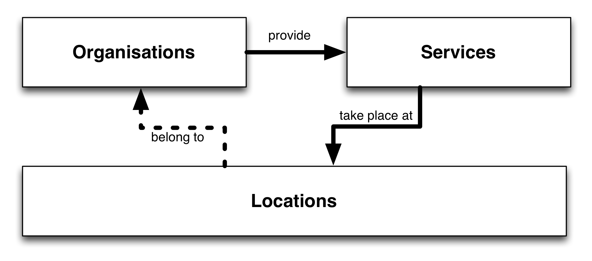

Logical Model
=============

There are three key concepts in HSDS:

1. **Services** - which may have descriptions, contact details, opening times, target groups, eligibility requirements, accessibility information, and other important facts about them published so that people are able to identify and access services that can meet their needs. 
2. **Organisations** - who provide those services.
3. **Locations** - where those services are delivered - either physically, or virtually (over the phone or Internet).

In addition, HSDS can be used to capture extra information about the **programs** that organisations use to organise and fund collections of services.

The central model is represented below:

Alongside tables describing each organisation, location and service, a number of more loosely coupled tables exist. These may include foreign keys for one or more of organisations, services and locations. 

For example, the [phone](reference.md#phone) table can link a phone number to a location, a service, or an organization **or** to a combination of those (e.g. to specify that it is the phone number of a specific service *at* a specific location). 

### Draft model

The model below is now deprecated and should not be used. It is maintained here until version 1.1 for reference. 

*  Note that although the relationships are not depicted, metadata.resource_id is the foreign key to all entities
