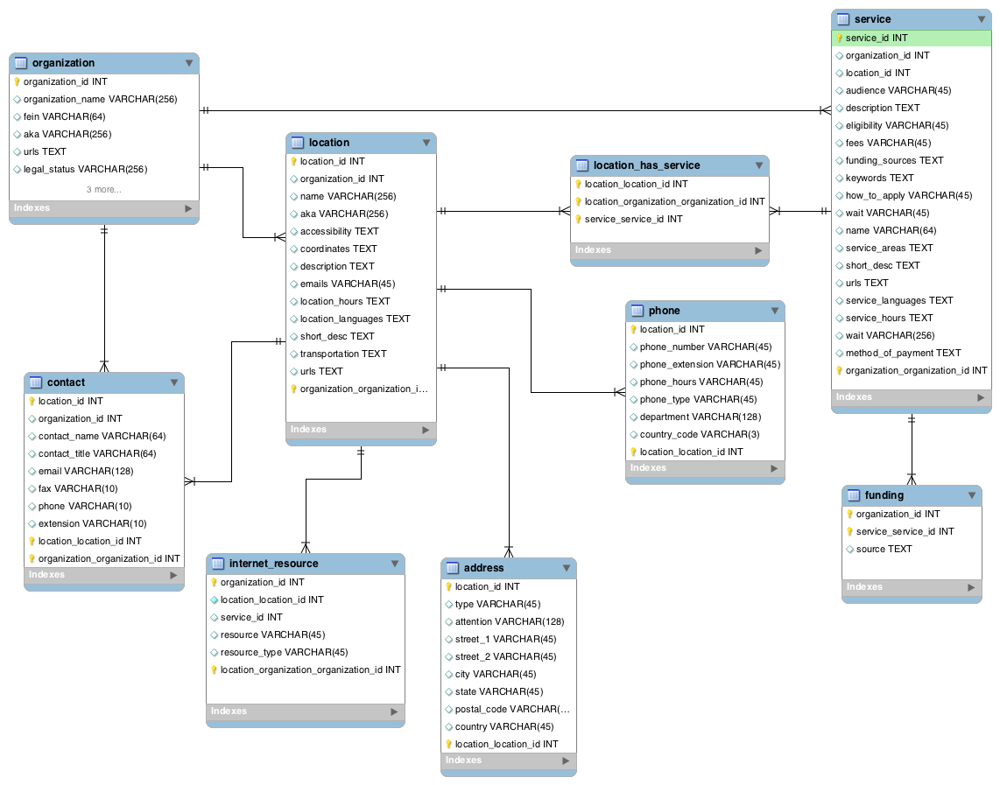

# OpenReferral

This specification defines a minimum set of data elements for OpenReferral, a human services data interchange specification. The idea behind the specification is to create shareable multi-purpose human service data sets. The goal is to derive a specification robust enough to support Information and Retrieval (IR) applications, yet flexible enough to support localized directories. The focus of this specification is content but a significan portion of the specification is dedicated to a design that reduces data structures into comma delimited files (CSV).

# Term Definitions

* Field required - The field column must be included in your feed, and a value must be provided for each record. Some required fields permit an empty string as a value. To enter an empty string, just omit any text between the commas for that field. Note that 0 is interpreted as "a string of value 0", and is not an empty string. Please see the field definition for details.

* Field optional - The field column may be omitted from your feed. If you choose to include an optional column, each record in your feed must have a value for that column. You may include an empty string as a value for records that do not have values for the column. Some optional fields permit an empty string as a value. To enter an empty string, just omit any text between the commas for that field. Note that 0 is interpreted as "a string of value 0", and is not an empty string.

# Conventions

This specification uses snake case where compound words are joined by an underscore. Field names are all lower case and in snake case, e.g. `organization_id`.


# Data Model

The basic entities are an organization or agency, a location (or site), and a service or program. 
The structure supports a model where organization has one or more locations that provide one or more services, or conversely one or more services can have one or more locations.

The lowest common denominator for data exchange is the comma delimited text file or CSV. CSV are simple table structures. In order to represent complex data types such as arrays and objects, they need to be decomposed into individual tables that are joined to parent tables via a foreign key. The entity relationship diagram below shows how the CSV files are joined to form a single organization.




# Content

The data model is divided in organizations, locations and services. The following tables define the minimum set of data needed for a human services data specification.

## Organization

| Name | Type | Requirement | Detail |
|:-----|:-----|:---------|:-------|
| organization_id | int | required | ID that uniquely identifies the organization | 
| name | string | required | Name of the organization
| fein | string | optional | Federal Employer Identification Number |
| aka | string | optional | Alias or Also Known As |
| legal_status | string | optional | Legal business structure of the organization |
| year_of_incorporation | date | optional | Date organization was founded or incorporated |
| licenses | text | optional | Licenses that the organization holds | 
| accreditation | text | optional | Accreditations earned by the organizationa |

## Location

| Name | Type | Requirement | Detail |
|:-----|:-----|:---------|:-------|
| location_id | int | required | ID that uniquely identifies the location |
| organization_id | int | required | ID that uniquely identifies the organization the location belongs to | 
| name | string | required | Name of the location |
| aka | string | optional | Alias or Also Known As |
| accessibility | array of strings | optional | Accessibility options available at the location. See [Accessibility](#accessibility) section for accepted values. |
| coordinates | text | optional | Coordinates of the location expressed as [longitude, latitude] using the WGS84 datum |
| description | string | required | Description of services provided at the location |
| location_hours | string | optional | Hours of operation for the location | 
| location_languages | array of strings | optional | Languages spoken at the location |
| name | string | required | Name of the location |
| phones | array of objects | optional | Phone numbers for the location. See [Phones](#phones) section for object fields. |
| short_desc | string | required | Succinct description of services provided at the location. 200 characters maximum. | 
| transportation | string | optional | Public transportation options near the location |
| accessibility | enumerated or comma separated strings | optional | Accessibility features at the location |

## Service

| Name | Type | Requirement | Detail |
|:-----|:-----|:---------|:-------|
| location_id | string | required | An ID that uniquely identifies the location the service belongs to |
| organization_id | int | required | ID that uniquely identifies the organization the location belongs to | 
| name | string | optional | Name of the service |
| service_id | string | required | An ID that uniquely identifies the service |
| audience | string | optional | Group of people served |
| description | string | optional | Description of the service provided |
| eligibility | string | optional | Requirements to receive the service |
| fees | string | optional | Fees charged to receive the service |
| keywords | text | optional | Keywords that define this service for search purposes |
| how_to_apply | string | optional | Description of how to apply to receive the service |
| service_areas | text | optional | Cities and Counties served. See [Service Areas](#wiki-service-areas) section for more details. |
| short_desc | string | optional | Succinct description of the service provided. 200 characters maximum. | 
| service_hours | string | optional | Hours of operation for the service |
| service_languages | comma-separated strings | optional | Languages in which service is regularly available |
| wait | string | optional | Wait times associated with the service |
| method_of_payment | comma separated strings | optional | Types of payment accepted, can be enumerated |

###Address
| HSD Name  | Data Type | Required | Detail |
|:----------|:----------|:---------|:--------|
| location_id | string | required | ID that uniquely identifies the location the address belongs to |
| organization_id | int | required | ID that uniquely identifies the organization the location belongs to |
| type | string | required | Denotes whether it is a physical or mailing address |
| attention | string | optional | Name of person or organization receiving mail |
| street | string | required | Contains the street number, street prefix, street name, street postfix |
| city | string | required | The city or appropriate administrative unit where the location resides |
| state | string | required | The state or appropriate administrative unit where the location resides, If in the US, use the two letter abbreviation |
| postal_code | string | required | The postal code where the location resides. |
| country | string | optional | The country where the location resides. Use [ISO 3166](http://www.iso.org/iso/home/standards/country_codes.htm) for country designators. |

###Contact
| Name | Type | Requirement | Detail |
|:-----|:-----|:---------|:-------|
| location_id | int | required | ID that uniquely identifies the location |
| organization_id | int | required | ID that uniquely identifies the organization the location belongs to |
| service_id | string | required | An ID that uniquely identifies the service |
| type | string | required | Differentiate between service and administrative contacts |
| contact_name | string | required | The Contact's full name |
| title | string | required | The Contact's title |
| email | string | optional | The Contact's email address |
| fax | string | optional | The Contact's 10-digit US fax number. Formatting is lenient. |
| phone | string | optional | The Contact's 10-digit US phone number. Formatting is lenient. |
| extension | string | optional | The Contact's phone number extension. For example: "x1234" |

###Phone
| Name | Type | Requirement | Detail |
|:-----|:-----|:---------|:-------|
| location_id | string | required | ID that uniquely identifies the location the phone number belongs to |
| organization_id | int | required | ID that uniquely identifies the organization the location belongs to |
| service_id | string | required | An ID that uniquely identifies the service |
| phone_number | string | required | The Location's 10-digit US phone number. Formatting is lenient. |
| vanity_number | string | optional | The Location's 10-digit US phone number with vanity letters. For example: 703-555-HELP |
| phone_extension | string | optional | The Location's phone number extension. For example: "x1234" |
| phone_hours | string | optional | Hours that phone number is manned |
| department | string | optional | The Location's department this phone number reaches. |
| type | string | required | Phone type values can be voice, fax, or tty. |
| country_code | string | optional | Country telephone code prefix based in [ITU E.123](http://www.itu.int/rec/T-REC-E.123-200102-I/en) standard.

###Internet_Resource

| Name | Type | Requirement | Detail |
|:-----|:-----|:---------|:-------|
| location_id | string | optional | ID that uniquely identifies the location the phone number belongs to |
| organization_id | int | optional | ID that uniquely identifies the organization the location belongs to |
| service_id | string | required | An ID that uniquely identifies the service |
| resource | text | required | URI or email address to resource|
| resource_type | required | Type of resource: email, website, application |

###Funding

| Name | Type | Requirement | Detail |
|:-----|:-----|:---------|:-------|
| organization_id | int | optional | ID that uniquely identifies the organization the location belongs to |
| service_id | string | required | An ID that uniquely identifies the service |
| source | text | required | URI or email address to resource|


# Data Format

The OpenReferral interchange format is composed of a set of files. This section defines the format and contents of files.

* Data is saved in a comma-delimited file, string elements must be enclosed by double quotes
* The first line of each file must contain field names. Each subsection of the Field Definitions section corresponds to one of the files and lists the field names you may use in that file.
* Field names are case sensitive
* Field values may not contain tabs, carriage returns or new lines
*Field values that contain quotation marks or commas must be enclosed within quotation marks. In addition, each quotation mark in the field value must be preceded with a quotation mark. This is consistent with the manner in which Microsoft Excel outputs comma-delimited (CSV) files. For more information on the CSV file format, see http://tools.ietf.org/html/rfc4180.
  * The following example demonstrates how a field value would appear in a comma-delimited file:
  * Original field value: Contains "quotes", commas and text
  * Field value in CSV file: "Contains ""quotes"", commas and text"
* Field values must not contain HTML tags, comments or escape sequences.
* Remove any extra spaces between fields or field names.
* Each line must end with a CRLF or LF linebreak character.
* Files should be encoded in UTF-8 to support all Unicode characters.


## Files

The following table list the files that make up the OpenReferral interchange format.

| File  | Required | Defines |
|:------|:---------:|:--------|
| organization.csv | required | Organization that provides human services. |
| location.csv | required | Locations that provide human services. |
| services.csv | required | Services provided at a location. |
| address.csv | required | location addresses |
| contact.csv | optional | Location points of contact and their contact details. |
| phone.csv | optional | Phone numbers, departments, and types (voice, fax, tty). |
| internet_resource.csv | optional | Emails, websites, applications. |
| funding.csv | optional | Funding sources. |


## Field Definitions
Mapping JSON objects to a flat file format requires normalization of data. This means breaking up objects and arrays into individual tables and adding keys to enable joining them in either a JSON object or in a relational database.


### Organization 
organization.csv

| Name | Type | Requirement | Detail |
|:-----|:-----|:---------|:-------|
| organization_id | int | required | ID that uniquely identifies the organization | 
| name | string | required | Name of the organization
| fein | string | optional | Federal Employer Identification Number |
| aka | string | optional | Alias or Also Known As |
| legal_status | string | optional | Legal business structure of the organization |
| year_of_incorporation | date | optional | Date organization was founded or incorporated |
| licenses | comma-separated strings | optional | Licenses that the organization holds | 
| accreditation | comma-separated strings | optional | Accreditations earned by the organizationa |

### Location
location.csv

| Name | Type | Requirement | Detail |
|:-----|:-----|:---------|:-------|
| location_id | int | required | ID that uniquely identifies the location |
| organization_id | int | required | ID that uniquely identifies the organization the location belongs to | 
| name | string | required | Name of the location |
| aka | string | optional | Alias or Also Known As |
| accessibility | array of strings | optional | Accessibility options available at the location. See [Accessibility](#accessibility) section for accepted values. |
| coordinates | text | optional | Coordinates of the location expressed as [longitude, latitude] using the WGS84 datum |
| description | string | required | Description of services provided at the location |
| location_hours | string | optional | Hours of operation for the location | 
| location_languages | array of strings | optional | Languages spoken at the location |
| name | string | required | Name of the location |
| phones | array of objects | optional | Phone numbers for the location. See [Phones](#phones) section for object fields. |
| short_desc | string | required | Succinct description of services provided at the location. 200 characters maximum. | 
| transportation | string | optional | Public transportation options near the location |
| accessibility | enumerated or comma separated strings | optional | Accessibility features at the location |

### Service
service.csv

| Name | Type | Requirement | Detail |
|:-----|:-----|:---------|:-------|
| location_id | string | required | An ID that uniquely identifies the location the service belongs to |
| organization_id | int | required | ID that uniquely identifies the organization the location belongs to | 
| name | string | optional | Name of the service |
| service_id | string | required | An ID that uniquely identifies the service |
| audience | string | optional | Group of people served |
| description | string | optional | Description of the service provided |
| eligibility | string | optional | Requirements to receive the service |
| fees | string | optional | Fees charged to receive the service |
| keywords | text | optional | Keywords that define this service for search purposes |
| how_to_apply | string | optional | Description of how to apply to receive the service |
| service_areas | text | optional | Cities and Counties served. |
| short_desc | string | optional | Succinct description of the service provided. 200 characters maximum. | 
| wait | string | optional | Wait times associated with the service |
| service_hours | string | optional | Hours of operation for the service |
| service_languages | comma-separated strings | optional | Languages in which service is regularly available |
| method_of_payment | comma separated strings | optional | Types of payment accepted, can be enumerated |

### Address
address.csv

| HSD Name  | Data Type | Required | Detail |
|:----------|:----------|:---------|:--------|
| location_id | string | required | ID that uniquely identifies the location the address belongs to |
| organization_id | int | required | ID that uniquely identifies the organization the location belongs to |
| service_id | string | required | An ID that uniquely identifies the service |
| type | string | required | Denotes whether it is a physical or mailing address |
| attention | string | optional | Name of person or organization receiving mail |
| street | string | required | Contains the street number, street prefix, street name, street postfix |
| city | string | required | The city or appropriate administrative unit where the location resides |
| state | string | required | The state or appropriate administrative unit where the location resides, If in the US, use the two letter abbreviation |
| postal_code | string | required | The postal code where the location resides. |
| country | string | optional | The country where the location resides. Use [ISO 3166](http://www.iso.org/iso/home/standards/country_codes.htm) for country designators. |

### Contact
contact.csv

| Name | Type | Requirement | Detail |
|:-----|:-----|:---------|:-------|
| location_id | int | required | ID that uniquely identifies the location |
| organization_id | int | required | ID that uniquely identifies the organization the location belongs to |
| service_id | string | required | An ID that uniquely identifies the service |
| type | string | required | Differentiate between service and administrative contacts |
| contact_name | string | required | The Contact's full name |
| title | string | required | The Contact's title |
| email | string | optional | The Contact's email address |
| fax | string | optional | The Contact's 10-digit US fax number. Formatting is lenient. |
| phone | string | optional | The Contact's 10-digit US phone number. Formatting is lenient. |
| extension | string | optional | The Contact's phone number extension. For example: "x1234" |

###Phone
phone.csv

| Name | Type | Requirement | Detail |
|:-----|:-----|:---------|:-------|
| location_id | string | required | ID that uniquely identifies the location the phone number belongs to |
| organization_id | int | required | ID that uniquely identifies the organization the location belongs to |
| service_id | string | required | An ID that uniquely identifies the service |
| number | string | required | The Location's 10-digit US phone number. Formatting is lenient. |
| vanity_number | string | optional | The Location's 10-digit US phone number with vanity letters. For example: 703-555-HELP |
| extension | string | optional | The Location's phone number extension. For example: "x1234" |
| department | string | optional | The Location's department this phone number reaches. |
| type | string | required | Phone type values can be voice, fax, or tty. |
| country_code | string | optional | Country telephone code prefix based in [ITU E.123](http://www.itu.int/rec/T-REC-E.123-200102-I/en) standard.

###Internet Resource
internet_resource.csv

| Name | Type | Requirement | Detail |
|:-----|:-----|:---------|:-------|
| location_id | string | optional | ID that uniquely identifies the location the phone number belongs to |
| organization_id | int | optional | ID that uniquely identifies the organization the location belongs to |
| service_id | string | required | An ID that uniquely identifies the service |
| resource | text | required | URI or email address to resource|
| resource_type | required | Type of resource: email, website, application |

###funding
funding.csv

| Name | Type | Requirement | Detail |
|:-----|:-----|:---------|:-------|
| organization_id | int | optional | ID that uniquely identifies the organization the location belongs to |
| service_id | string | required | An ID that uniquely identifies the service |
| source | text | required | URI or email address to resource|


##Alternate formats

The data model can be expressed as [JSON, or JavaScript Object Notation](http://json.org). JSON is a lightweight data-interchange format easy for humans to read and write and for machines to parse and generate. JSON is a text format that is completely language independent. Learn more at [JSON.org](http://json.org) or [Wikipedia/JSON](http://en.wikipedia.org/wiki/JSON).


Below is an example JSON object that represents one organization, along with all of its locations, and all the services for each location. 

```json
{
  "name": "Peninsula Family Service",
  "locations": [
    {
      "accessibility": [
        "ramp",
        "restroom",
        "disabled_parking",
        "wheelchair"
      ],
      "address": {
        "street": "2600 Middlefield Road",
        "city": "Redwood City",
        "state": "CA",
        "zip": "94063"
      },
      "contacts": [
        {
          "name": "Susan Houston",
          "title": "Director of Older Adult Services",
          "email": "susan@houston.org",
          "fax": "703-555-1212",
          "phone": "703-555-1212",
          "extension": "x1234"
        },
        {
          "name": " Christina Gonzalez",
          "title": "Center Director"
        }
      ],
      "coordinates": [-122.2141324, 37.4773738],
      "description": "A walk-in center for older adults that provides social services, wellness, recreational, educational and creative activities including arts and crafts, computer classes and gardening classes. Coffee and healthy breakfasts are available daily. A hot lunch is served Tuesday-Friday for persons age 60 or over and spouse.        Provides case management (including in-home assessments) and bilingual information and referral about community services to persons age 60 or over on questions of housing, employment, household help, recreation and social activities, home delivered meals, health and counseling services and services to shut-ins. Health insurance and legal counseling is available by appointment. Lectures on a variety of health and fitness topics are held monthly in both English and Spanish.  Provides a variety of physical fitness opportunities, including a garden club, yoga, tai chi, soul line dance and aerobics classes geared toward older adults. Also provides free monthly blood pressure screenings, quarterly blood glucose monitoring and health screenings by a visiting nurse. Offers a Brown Bag Program in which low-income seniors can receive a bag of groceries each week for a membership fee of $10 a year. Offers Spanish lessons. Formerly known as Peninsula Family Service, Fair Oaks Intergenerational Center. Formerly known as the Fair Oaks Senior Center. Formerly known as Family Service Agency of San Mateo County, Fair Oaks Intergenerational Center.",
      "emails": [
        "cgonzalez@peninsulafamilyservice.org"
      ],
      "hours": "Monday-Friday, 9-5",
      "languages": [
        "Filipino (Tagalog)",
        "Spanish"
      ],
      "mail_address": {
        "attention": "Fair Oaks Intergenerational Center",
        "street": "2600 Middlefield Road",
        "city": "Redwood City",
        "state": "CA",
        "zip": "94063"
      },
      "name": "Fair Oaks Adult Activity Center",
      "phones": [
        {
          "number": "650 780-7525",
          "department": "Reception",
          "type": "voice"
        },
        {
          "number": "703 555-1212",
          "department": "Reception",
          "type": "fax"
        }
      ],
      "short_desc": "A multipurpose senior citizens' center serving the Redwood City area.",
      "transportation": "SAMTRANS stops in front.",
      "urls": [
        "http://www.peninsulafamilyservice.org"
      ],
      "services": [
        {
          "audience": "Older adults age 55 or over, ethnic minorities and low-income persons",
          "eligibility": "Age 55 or over for most programs, age 60 or over for lunch program",
          "fees": "$2.50 suggested donation for lunch for age 60 or over, donations for other services appreciated.",
          "funding_sources": [
            "City",
            "County",
            "Donations",
            "Fees",
            "Fundraising"
          ],
          "keywords": [
            "ADULT PROTECTION AND CARE SERVICES",
            "Meal Sites/Home-delivered Mea",
            "COMMUNITY SERVICES",
            "Group Support",
            "Information and Referral",
            "EDUCATION SERVICES",
            "English Language",
            "RECREATION/LEISURE SERVICES",
            "Arts and Crafts",
            "Sports/Games/Exercise",
            "Brown Bag Food Programs",
            "Congregate Meals/Nutrition Sites",
            "Senior Centers",
            "Older Adults"
          ],
          "how_to_apply": "Walk in or apply by phone.",
          "service_areas": [
            "Redwood City"
          ],
          "wait": "No wait."
        }
      ]
    },
    {
      "accessibility": [
        "wheelchair"
      ],
      "address": {
        "street": "24 Second Avenue",
        "city": "San Mateo",
        "state": "CA",
        "zip": "94401"
      },
      "contacts": [
        {
          "name": "Brenda Brown",
          "title": "Director, Second Career Services"
        }
      ],
      "description": "Provides training and job placement to eligible people age 55 or over who meet certain income qualifications. An income of 125% of poverty level or less is required for subsidized employment and training. (No income requirements for job matchup program.) If a person seems likely to be qualified after a preliminary phone call or visit, he or she must complete an application at this office. Staff will locate appropriate placements for applicants, provide orientation and on-the-job training and assist with finding a job outside the program. Any county resident, regardless of income, age 55 or over has access to the program, job developers and the job bank. Also provides referrals to classroom training. Formerly known as Family Service Agency of San Mateo County, Senior Employment Services.",
      "emails": [
        "bbrown@peninsulafamilyservice.org"
      ],
      "hours": "Monday-Friday, 9-5",
      "languages": [
        "Chinese (Mandarin)",
        "Filipino (Tagalog)",
        "Italian",
        "Spanish"
      ],
      "mail_address": {
        "attention": "PFS Second Career Services",
        "street": "24 Second Avenue",
        "city": "San Mateo",
        "state": "CA",
        "zip": "94401"
      },
      "name": "Second Career Employment Program",
      "phones": [
        {
          "number": "650 403-4300",
          "department": " Ext. 4385",
          "hours": "(Monday-Friday, 9-5)"
        }
      ],
      "short_desc": "Provides training and job placement to eligible persons age 55 or over. All persons age 55 or over have access to information in the program's job bank.",
      "transportation": "SAMTRANS stops within 1 block, CALTRAIN stops within 6 blocks.",
      "urls": [
        "http://www.peninsulafamilyservice.org"
      ],
      "services": [
        {
          "audience": "Residents of San Mateo County age 55 or over",
          "eligibility": "Age 55 or over, county resident and willing and able to work. Income requirements vary according to program",
          "fees": "None. Donations requested of clients who can afford it.",
          "funding_sources": [
            "County",
            "Federal",
            "State"
          ],
          "keywords": [
            "EMPLOYMENT/TRAINING SERVICES",
            "Job Development",
            "Job Information/Placement/Referral",
            "Job Training",
            "Job Training Formats",
            "Job Search/Placement",
            "Older Adults"
          ],
          "how_to_apply": "Apply by phone for an appointment.",
          "service_areas": [
            "San Mateo County"
          ],
          "wait": "Varies."
        }
      ]
    }
  ]
}
```

# Extending OpenReferral 

The specification can be extended or modified with additional data elements. If the data type is simple it can be directly added to the organizations, locations and services table definitions. If the data type is complex, e.g. an array or an object, then an additional CSV file will be necessary. Foreign key should be assigned as needed with the intended purpose of the data.
